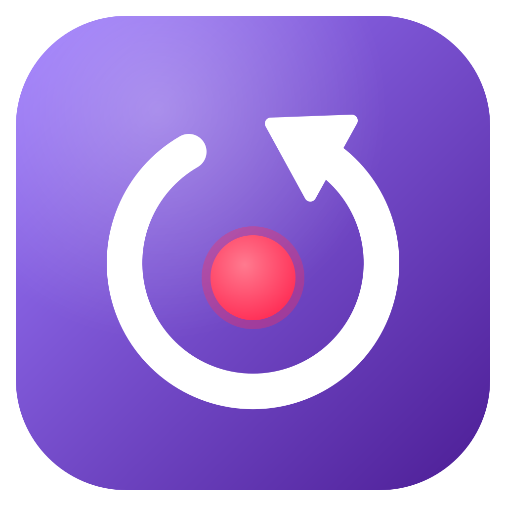

  

<h1 align="center">Delay Live</h1>

Controle o delay da sua live <b>sem encerrar a transmissão</b>.

## Download

**[⬇️ Baixar a versão mais recente para Windows](https://github.com/danyelvarejao/delay-live-releases/releases/latest)**. Na página da release, baixe o arquivo `Delay.Live_x.y.z_x64-setup.exe`.

Depois de instalado, o app se atualiza sozinho: quando sair uma versão nova, ele avisa e instala com um clique.

### O Windows mostrou "O Windows protegeu o computador"?

Isso acontece com apps novos que ainda não têm reputação no Windows. Clique em **Mais informações** e depois em **Executar assim mesmo**.

## O que ele faz

- **Delay instantâneo:** ative 15s, 30s, 60s (ou o valor que quiser) e a live volta no tempo na hora; volte ao vivo quando quiser. A conexão com a plataforma nunca cai.
- **Sua stream key fica no OBS:** o Delay Live só recebe o vídeo e repassa para a plataforma.
- **Twitch, YouTube, Kick, TikTok, Restream** e RTMP personalizado, inclusive várias ao mesmo tempo.

## Como usar

1. Abra o Delay Live e ligue a sua plataforma em **Plataformas**.
2. No OBS: **Configurações → Transmissão → Serviço: Personalizado**.
   - Servidor: o endereço que o app mostra (ex.: `rtmp://127.0.0.1:1935/twitch`).
   - Chave de transmissão: a sua stream key de sempre.
3. Inicie a transmissão no OBS e controle o delay pelo **Painel** do app.

Dúvidas? Veja a página **Ajuda** dentro do app.

## Problemas e sugestões

Abra uma [issue](https://github.com/danyelvarejao/delay-live-releases/issues). Em **Configurações → Diagnóstico** você pode copiar o log da transmissão para anexar (a stream key nunca aparece nos logs).
